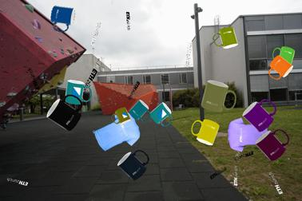
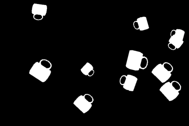
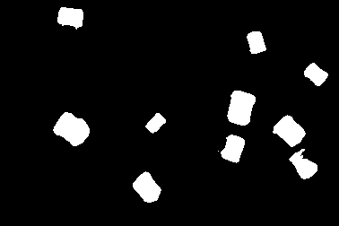

# PyTorch U-Net for Binary Mug Segmentation

## Overview

This repository contains a **binary image segmentation** project developed as part of a university machine learning course. The task is to segment **mugs** from RGB images by predicting a binary mask for each input image.

The goal was not to detect arbitrary mugs in general: other mugs could also appear in the scene, including unlabeled mugs or mugs with different labels, and were treated as background. This makes the task more selective than generic mug segmentation.

The project implements a **custom U-Net style convolutional neural network in PyTorch** together with a full training and evaluation pipeline.

My main work focused on:
- implementing and configuring the U-Net architecture
- building the training loop
- adding data augmentation for image / mask pairs
- setting up validation, checkpointing, and IoU-based evaluation

Some parts of the original project scaffolding, particularly parts of the testing setup, were provided as part of the course.

---

## Model

The segmentation model is a **custom U-Net** with:

- encoder-decoder structure
- skip connections
- repeated convolutional blocks with batch normalization and ReLU
- single-channel binary mask prediction for binary segmentation

U-Net was chosen because this task needs both:

- **semantic understanding**: deciding whether a region belongs to the target ETH-labeled mug rather than background or another mug
- **pixel-level localization**: recovering a sharp segmentation mask rather than only a bounding box or image-level label

Compared with a plain image classifier, U-Net preserves spatial structure and predicts one output value per pixel. Compared with a much heavier perception backbone, it is relatively simple to implement, train, and debug on a modest dataset.

After the initial implementation, I also evaluated a **shallower U-Net variant** with one fewer encoder-decoder level. Keeping both sets of results was useful because it made the architecture tradeoff visible: on this dataset, reducing depth helped, but only when enough channel capacity was retained.

The model itself outputs **logits**, not probabilities. During training those logits are passed directly to `BCEWithLogitsLoss`, and during validation / test they are converted to probabilities with a sigmoid before thresholding into a binary mask.

---

## Training Pipeline

The project includes:

- **BCEWithLogits loss**
- **Adam optimizer**
- **learning-rate scheduling**
- **early stopping**
- **checkpointing**
- **validation using Intersection over Union (IoU) on a held-out split from the training set**

The dataset pipeline applies deterministic resizing and normalization for validation / test data, while training uses synchronized flips for image-mask pairs together with image-only color jitter.

---

## Example Result

-  Best public-test IoU observed in the architecture sweep: `0.9041`
<p align="center">
  
  
  
</p>

<p align="center">
  <em>Example model output on the mug segmentation task. From left to right: input image, ground-truth mask, and predicted mask.</em>
</p>

## Architecture Comparison

I ran a small architecture sweep over U-Net depth and width:

| U-Net Depth | `base_channels=16` | `base_channels=32` | `base_channels=64` |
| --- | ---: | ---: | ---: |
| 5 levels | 0.8369 | 0.8606 | 0.8681 |
| 4 levels | 0.7910 | 0.8494 | 0.9041 |
| 3 levels | - | - | **0.9123** |
| 2 levels | - | 0.7460 | 0.8526 |

The main takeaway from this sweep is that a **3-level U-Net with `base_channels=64`** performed best on the public test split. Across the tested configurations, performance improved as depth was reduced from 5 levels to 3 levels, then dropped again at 2 levels, while reducing channel width also generally hurt performance.

### Additional Experiments

`-` indicates that this configuration was not run.

## Failure Cases And Limitations

- The model is trained offline on a relatively small supervised dataset, so performance may degrade under viewpoint, lighting, and background shifts not represented in the training set.
- It is a binary segmentation setup for a specific target mug class, not a general object-understanding system.
- The project does not yet include calibration, timing benchmarks, deployment optimization, or integration into a robotics stack.
- Results are reported with IoU on the provided dataset splits only; there is no ablation study or robustness analysis yet.

### Installation

```bash
python3 -m venv .venv
source .venv/bin/activate
pip install -r requirements.txt
```

### Training a model

```bash
python src/train.py --data_root ./datasets --ckpt_dir ./checkpoints --val_split 0.2 --seed 42
```

This creates a timestamped run directory containing per-epoch checkpoints and the best validation checkpoint at `checkpoint.pth`.

Separate evaluation can be done on a private test set, for example

```bash
python src/test.py --data_root ./datasets --split private_test --ckpt ./checkpoints/<timestamp>/checkpoint.pth
```

Public-set evaluation with IoU reporting can be run with:

```bash
python src/test.py --data_root ./datasets --split public_test --ckpt ./checkpoints/<timestamp>/checkpoint.pth
```
